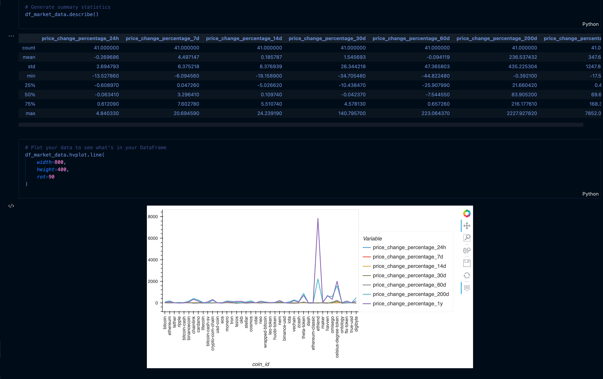

# Crypto Portfolio Proposal


This is a jupyter notebook analysis of crypto currecy investments that utilizes the KMeans to identify the clusters for crypto investment profitability.


## Technologies


* [Pandas](https://github.com/pandas-dev/pandas) - Pandas is an open-source library that offers easy-to-use data analysis tools for Python.

* [Jupyter Lab](https://github.com/jupyterlab/jupyterlab-git) - For interactive analysis prompts and a code as you code structure


* [sklearnLibrary] (https://scikit-learn.org/stable/)

* [scikit-learn] (https://scikit-learn.org/stable/install.html)


## Installation Guide 

Before running the application first install the following:


* [Install] Anaconda with Python 3.7+(https://docs.anaconda.com/anaconda/install/)

You should always be in a conda dev environment when launching JupyterLab.
```
pip install -U scikit-learn
conda install -c pyviz hvplot
```


## Required Imports
* pandas - Data analyis and Manipulation 
* hvPlot - Interactive Plotting tools
* KMeans -  Algorithmic Analysis 
* PCA - Statistical Analysis


## Required Dependencies
* import pandas as pd
* import hvplot.pandas
* from path import Path
* from sklearn.cluster import KMeans
* from sklearn.decomposition import PCA
* from sklearn.preprocessing import StandardScaler


## Usage

To view the crypto_investments.ipynb, open Terminal/ Use CLI

```conda activate dev
cd <location of (crypto_investments.ipynb)>
jupyter lab
```
## Visualizations.




---

## Contributors

Brought to you by MartyCodes333 (martique.henton@gmail.com) with the help of 2021 UW FinTech Bootcamp Instructors, TA's and Fellow Classmates


---